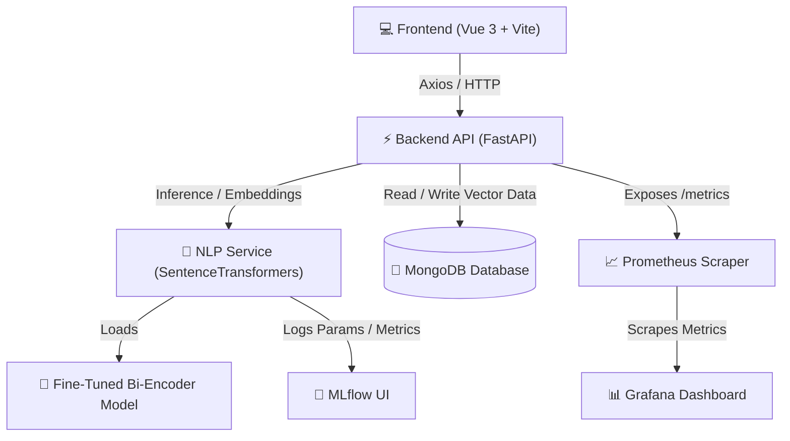

# 🎯 HIREZY: Intelligent Recruitment & Talent Analytics Platform

## 📖 Overview

**HIREZY** is an AI-powered recruitment and talent analytics platform designed to automate candidate screening, job matching, semantic job recommendation, and talent pool management using Natural Language Processing (NLP) and Sentence Transformers. 

The system leverages a fine-tuned multilingual Bi-Encoder to support both **Job Seekers** and **Recruiters / HR Professionals** through highly accurate semantic search, explainable AI matching, and talent pool tracking.

---

## 🏗️ System Architecture

The following diagram illustrates how the system's components interact:



---

## 🚀 Key Features

### 🔍 Job Seeker Module

*   **CV ↔ Job Description Matching**: 
    Perform deep semantic comparison using a fine-tuned Bi-Encoder to generate a similarity score, analyze skill coverage, and produce human-readable reasoning.
    
    *Example Match Output:*
    ```json
    {
      "match_score": 87.5,
      "recommendation": "Strong Match",
      "matched_skills": ["Python", "Docker", "FastAPI"],
      "missing_skills": ["Kubernetes"]
    }
    ```

*   **Semantic Job Search**: 
    Upload a CV to retrieve the top-K matching job descriptions stored in MongoDB using dense vector similarity search.
    *   *Features*: Embedding-based retrieval, similarity-based ranking, and interactive list view.

*   **LinkedIn Job Scraping**: 
    Automatically scrape job posts from LinkedIn based on custom **Keywords**, **Location**, and **Time Range**, saving them alongside generated description embeddings.

---

### 👥 Recruiter / HR Module

*   **Candidate Ranking**: 
    Upload a folder of CV PDFs and rank them against a target job description. The final score is computed using a **3-component smart scoring formula** that rewards domain alignment:
    
    $$\text{Final Score} = (70\% \times \text{Semantic}) + (10\% \times \text{Coverage}_{\text{adj}}) + (20\% \times \text{Domain Relevance})$$

    > **Domain Alignment Rule**: IT CV + IT JD → highest score. IT CV + Finance JD → lower score (0% domain relevance bonus).

*   **Talent Pool**: 
    Store promising candidates who are not selected for immediate interview but may be useful in future recruitment. Candidates are sorted by match score and addition date, allowing search, filtering, and status updates.
    *   *Benefits*: Centralized talent storage, candidate pipeline status tracking, and easy search/filtering.

*   **Explainable AI (XAI)**: 
    Every match analysis is backed by an automated explanation that breaks down matched skills, missing competencies, and a reasoning summary:
    
    ```json
    {
      "reasoning": [
        "Candidate matches 8 required skills.",
        "Missing skills: Kubernetes, Terraform.",
        "Overall recommendation: Strong Match."
      ]
    }
    ```

---

## 🎯 Smart Scoring Engine

All match scores across **CV-JD Analysis**, **HR Ranking**, and **Bulk Candidate Screening** use a unified 3-component formula to ensure domain-appropriate scoring:

```
Final Score = (Semantic × 70%) + (Coverage_adjusted × 10%) + (Domain Relevance × 20%)
```

### Components

| Component | Weight | Description |
| :--- | :---: | :--- |
| **Semantic Similarity** | 70% | Bi-Encoder cosine similarity between full CV text and JD text |
| **Skill Coverage (adjusted)** | 10% | % of JD-required skills found in CV, penalized by JD skill depth |
| **Domain Relevance** | 20% | % of the selected domain's skill list that appears in the CV |

### Skill Reliability Penalty

JDs that contain very few skills (e.g., a Finance JD with only 2 skills) receive a reliability penalty on the coverage component:

```python
MIN_RELIABLE_SKILLS = 8
skill_reliability = min(1.0, total_jd_skills / 8)
coverage_adjusted = coverage_ratio × skill_reliability
```

**Example:**
- Finance JD has 2 skills → `reliability = 0.25` → coverage bonus is reduced by 75%
- IT JD has 16 skills → `reliability = 1.0` → full coverage weight applies

### Domain Relevance Scoring

Domain relevance measures how many of the **selected domain's master skill list** appear in the CV, regardless of what the JD requires:

```python
# Count how many IT domain skills appear in the CV
cv_domain_hits = sum(1 for skill in domain_skills if skill in cv_text)
domain_relevance = (cv_domain_hits / total_domain_skills) × 100
```

**Result:** An IT CV submitted against an IT JD will always score higher than the same CV submitted against an HR or Finance JD.

---

## 📊 MLOps & Monitoring

### 🧪 Experiment Tracking (MLflow)
The model training pipelines log hyperparameters, datasets, and performance metrics to local MLflow servers.
*   **Tracked Items**: Dataset version, training epochs, batch size, Precision@K, Recall@K, MRR, and NDCG.
*   **Start Server**: `mlflow ui`
*   **Access Web UI**: [http://localhost:5000](http://localhost:5000)

### 📈 Metrics Scraper (Prometheus)
Real-time metrics are scraped from the FastAPI `/metrics` endpoint to log API behavior.
*   **Metrics Endpoint**: [http://localhost:8000/metrics](http://localhost:8000/metrics)

| Metric | Type | Description |
| :--- | :--- | :--- |
| `cv_matcher_requests_total` | Counter | Total API requests received (labeled by endpoint) |
| `cv_matcher_request_latency_seconds` | Histogram | Request latency distribution (labeled by endpoint) |
| `cv_matcher_analysis_total` | Counter | Total CV-JD match analysis requests |
| `semantic_search_total` | Counter | Total semantic job search requests |
| `hr_ranking_total` | Counter | Total HR ranking requests |
| `talent_pool_total` | Counter | Total talent pool requests |

### 📉 Visualization Dashboard (Grafana)
A pre-configured dashboard displays real-time API health, latency metrics, and throughput.
*   **Default Credentials**: Username: `admin` | Password: `admin`
*   **Access Web UI**: [http://localhost:3050](http://localhost:3050)

---

## 🧠 Model Development

*   **Base Model**: `paraphrase-multilingual-MiniLM-L12-v2` (from SentenceTransformers)
*   **Fine-Tuned Model**: Located locally in `models/bi-encoder-cv-matcher`
*   **Training Loss Function**: `MultipleNegativesRankingLoss`
*   **Dataset**: 12,480 triplets generated from 4 Kaggle datasets (Job Skills, LinkedIn Jobs, Resume Dataset, Job Descriptions) with hard negative mining and Indonesian back-translation augmentation

### 📊 Evaluation Results

| Metric | Baseline (Pretrained) | Fine-Tuned Model |
| :--- | :---: | :---: |
| **Test Triplet Accuracy** | 65.46% | **83.41%** |
| **Val Triplet Accuracy** | 63.86% | **84.13%** |
| **Improvement** | — | **+17.95%** |
| **Training Time** | — | **9.8 minutes** |

---

## 🧪 Testing & CI/CD

### Running Tests Locally:
Inside the `backend/` directory, run:
```bash
python -m pytest test -v
```

### Running Test Coverage Analysis:
```bash
python -m pytest test --cov=app --cov-report=term
```

**Test Files Included:**
*   `test_parser.py`: Evaluates PDF/text extraction and pre-processing.
*   `test_explainability.py`: Validates recommendation logic thresholds.
*   `test_match_api.py`: Tests CV-JD detailed matching endpoint with mocks.
*   `test_semantic_search.py`: Validates vector search with MongoDB mocks.
*   `test_hr_rank.py`: Tests the HR bulk candidate ranking logic.
*   `test_talent_pool.py`: Tests candidate status transitions and talent pool operations.
*   `test_analytics_dashboard.py`: Tests analytics endpoints.
*   `test_auth.py`: Tests authentication flows.
*   `test_candidate_semantic_search.py`: Tests candidate search.
*   `test_interview_scheduler.py`: Tests interview scheduling.
*   `test_resume_advisor.py`: Tests resume advisor.
*   `test_skill_filtering.py`: Tests skill filtering logic.
*   `conftest.py`: Shared test configuration and fixtures.

### CI/CD Workflow
Implemented using GitHub Actions (`.github/workflows/backend.yml`), triggers automatically on `push` and `pull_request` to verify the codebase:
1.  Checkout repository
2.  Setup Python 3.10
3.  Install dependencies (`python -m pip install -r requirements.txt`)
4.  Run tests (`python -m pytest test -v`)
5.  Validate Docker Compose configurations

---

## 📁 Project Structure

```
.
├── .github/
│   └── workflows/
│       └── backend.yml        # CI pipeline config
├── backend/
│   ├── app/
│   │   ├── api/
│   │   │   ├── endpoints.py       # Core APIs (scrape, match, search)
│   │   │   ├── hr_endpoints.py    # HR APIs (rank, talent-pool, stats)
│   │   │   └── jobs_endpoints.py  # Jobs operations
│   │   ├── core/
│   │   │   ├── domain_loader.py   # Dynamic domain config loader
│   │   │   ├── metrics.py         # Prometheus metrics counters
│   │   │   ├── mongodb.py         # MongoDB connection helper
│   │   │   └── skills/            # Domain-specific JSON configs
│   │   │       ├── it.json
│   │   │       ├── hr.json
│   │   │       ├── finance.json
│   │   │       ├── creative.json
│   │   │       ├── sales.json
│   │   │       ├── legal.json
│   │   │       ├── pr.json
│   │   │       ├── ga.json
│   │   │       ├── cs.json
│   │   │       ├── operational.json
│   │   │       └── general.json
│   │   ├── services/
│   │   │   ├── linkedin_scraper.py# BeautifulSoup job scraper
│   │   │   ├── nlp.py             # NLP match, search, clustering + domain relevance
│   │   │   ├── explainability.py  # Smart scoring formula (3-component hybrid)
│   │   │   ├── progress.py        # SSE job progress tracker
│   │   │   └── parser.py          # PDF/DOCX parsing & cleaning logic
│   │   └── main.py                # FastAPI app entrypoint
│   ├── requirements.txt
│   └── Dockerfile
├── frontend/
│   ├── src/
│   │   ├── components/            # Reusable UI components
│   │   │   ├── ErrorState.vue     # Reusable error display component (4 types)
│   │   │   └── FloatingErrorBanner.vue # Non-intrusive toast-style error banner
│   │   ├── views/                 # View pages (Analyze, TalentPool, Scrape, Rank, etc.)
│   │   ├── router/                # Vue Router configuration
│   │   ├── App.vue                # Root App component
│   │   └── main.js                # App entrypoint
│   ├── Dockerfile
│   └── package.json
├── notebooks/                     # Kaggle Dataset Processing & Model Training
│   ├── 01_download_and_eda.ipynb
│   ├── 02_preprocessing.ipynb
│   ├── 03_triplet_generation.ipynb
│   └── 04_training_and_eval.ipynb
├── data/                          # Datasets (gitignored)
├── models/                        # Fine-tuned model outputs
├── docs/                          # Project documentation and slides
├── monitoring/                    # Prometheus and Grafana configs
├── .env.example                   # Env template
└── docker-compose.yml             # Orchestration file
```

---

## ⚙️ Dataset & Customization

### Training Dataset

The project uses 12,480 triplets generated from 4 Kaggle datasets (Job Skills, LinkedIn Jobs, Resume Dataset, Job Descriptions) with hard negative mining and Indonesian back-translation augmentation. Datasets are stored in `data/training/` as CSV files.

**File Structure:**
```
data/training/
├── bi_encoder_train.csv      # Triplet data (anchor, positive, negative)
└── README.md                 # Dataset format documentation
```

### Domain Configurations

Each domain has its own JSON configuration file in `backend/app/core/skills/`. These files define skills, roles, thresholds, and other domain-specific data.

**Available Domains:**
| File | Domain | Threshold (Direct) | Threshold (Master) |
| :--- | :--- | :---: | :---: |
| `it.json` | IT | 0.80 | 0.82 |
| `hr.json` | HR | 0.75 | 0.77 |
| `finance.json` | Finance | 0.75 | 0.77 |
| `creative.json` | Creative & Marketing | 0.70 | 0.72 |
| `sales.json` | Sales & Business Development | 0.70 | 0.72 |
| `legal.json` | Legal | 0.78 | 0.80 |
| `pr.json` | PR & Corcom | 0.72 | 0.74 |
| `ga.json` | GA | 0.70 | 0.72 |
| `cs.json` | CS & Aftersales | 0.70 | 0.72 |
| `operational.json` | Operational | 0.73 | 0.75 |
| `general.json` | General (Default) | 0.75 | 0.77 |

### Customizing Domain Skills

To add or modify skills for a specific domain, edit the corresponding JSON file in `backend/app/core/skills/`.

**Example: Adding a skill to `it.json`:**

```json
{
  "domain": "IT",
  "skills": [
    "Python", "JavaScript", "Docker", "Kubernetes",
    "Rust", "Go", "Terraform"
  ],
  "roles": [
    "Backend Engineer", "DevOps Engineer", "Site Reliability Engineer"
  ],
  "projects": [
    "REST API development", "CI/CD pipeline setup"
  ]
}
```

**Available Fields per Domain:**

| Field | Type | Description | Example |
| :--- | :--- | :--- | :--- |
| `skills` | `string[]` | Core competencies for the domain | `["Python", "Docker", "SQL"]` |
| `roles` | `string[]` | Job titles specific to the domain | `["Backend Engineer", "DevOps"]` |
| `teams` | `string[]` | Department/team names | `["Engineering", "Data Science"]` |
| `projects` | `string[]` | Domain-specific project types | `["API development", "migration"]` |
| `unrelated_industries` | `string[]` | Industries unrelated to domain | `["Farming", "Mining"]` |
| `unrelated_roles` | `string[]` | Roles from other domains | `["Graphic Designer", "Accountant"]` |
| `unrelated_tools` | `string[]` | Tools not used in this domain | `["Photoshop", "AutoCAD"]` |
| `experience_keywords` | `string[]` | Phrases indicating experience | `["years of experience"]` |
| `education_keywords` | `string[]` | Education-related terms | `["bachelor", "computer science"]` |
| `threshold_direct_match` | `float` | Similarity threshold for direct matching | `0.80` |
| `threshold_master_match` | `float` | Similarity threshold for master skill matching | `0.82` |

### Generating Datasets & Training

All dataset preprocessing, triplet generation, and model training are orchestrated sequentially via Jupyter Notebooks.

```bash
# 1. Download Kaggle datasets and run Exploratory Data Analysis
jupyter notebook notebooks/01_download_and_eda.ipynb

# 2. Preprocess, clean, and map datasets into a unified schema
jupyter notebook notebooks/02_preprocessing.ipynb

# 3. Generate triplets with hard negative mining
jupyter notebook notebooks/03_triplet_generation.ipynb

# 4. Train Bi-Encoder model and evaluate metrics
jupyter notebook notebooks/04_training_and_eval.ipynb
```

---

## 🛠️ Technology Stack

*   **Frontend**: Vue 3, Vite, Axios, Vanilla CSS
*   **Backend**: FastAPI, Sentence Transformers, PyTorch, Scikit-Learn, PyPDF, Python-docx
*   **Database**: MongoDB, Mongo Express
*   **Monitoring**: Prometheus, Grafana
*   **MLops**: MLflow
*   **DevOps**: Docker, Docker Compose, GitHub Actions (CI)
*   **Testing**: Pytest, Pytest-Cov, Pytest-Asyncio, HTTPX

---

## 🐳 Docker Deployment

To build and run all services (Frontend, Backend, Database, Prometheus, and Grafana) locally:

1.  **Configure environment variables**:
    ```bash
    cp .env.example .env
    ```
2.  **Build all images**:
    ```bash
    docker compose up --build
    ```
3.  **Run in the background (detached mode)**:
    ```bash
    docker compose up -d
    ```
4.  **Stop all containers**:
    ```bash
    docker compose down
    ```

### 🌐 Service Ports Summary

Once deployed, the following services are available:

| Service | Port / URL | Default Credentials |
| :--- | :--- | :--- |
| **Frontend Web App** | [http://localhost:5173](http://localhost:5173) | *None* |
| **FastAPI Swagger Docs** | [http://localhost:8000/docs](http://localhost:8000/docs) | *None* |
| **Mongo Express Web UI** | [http://localhost:8081](http://localhost:8081) | Username: `admin` \| Password: `password` |
| **Prometheus Dashboard** | [http://localhost:9090](http://localhost:9090) | *None* |
| **Grafana Dashboard** | [http://localhost:3050](http://localhost:3050) | Username: `admin` \| Password: `admin` |
| **MLflow Server (Local)** | [http://localhost:5000](http://localhost:5000) | *None* |

---

## 🔗 Available API Endpoints

### 🔍 Job Seeker Endpoints
*   `POST /api/match-detailed`: Semantic CV ↔ JD matching with full explainability (3-component smart scoring).
*   `POST /api/jobs/start`: SSE-based background CV-JD analysis with real-time progress tracking.
*   `POST /api/scrape-recommend`: Scrapes jobs from LinkedIn and triggers immediate recommendation.
*   `POST /api/jobs/semantic-search`: Semantic vector search against MongoDB job collection.

### 👥 Recruiter / HR Endpoints
*   `GET /api/talent-pool`: Retrieves candidates stored in the Talent Pool.
*   `GET /api/candidates`: Retrieves all candidates.
*   `PATCH /api/candidates/{id}/status`: Updates candidate status.
*   `GET /api/dashboard/hr-stats`: Retrieves HR dashboard stats.

### 💾 Database Utilities
*   `GET /api/jobs`: Fetches all jobs stored in the database.
*   `DELETE /api/jobs/clear`: Drops the scraped jobs collection.

### 📈 Health & Monitoring
*   `GET /`: Base API health check.
*   `GET /metrics`: Prometheus ASGI metrics exporter.

---

## 👥 Authors

- APC193D6Y0002 - Amirullah Hidayat [Aktif]
- APC306D6Y0321 - Farhan Alwanda [Aktif]
- APC246D6Y0411 - Yohanes Aditya Krismawan [Aktif]
- APC596D6Y0230 - Tito Purwana Sasmita [Aktif]

*   Built with FastAPI, Vue 3, PyTorch, MongoDB, MLflow, Prometheus, and Grafana.
